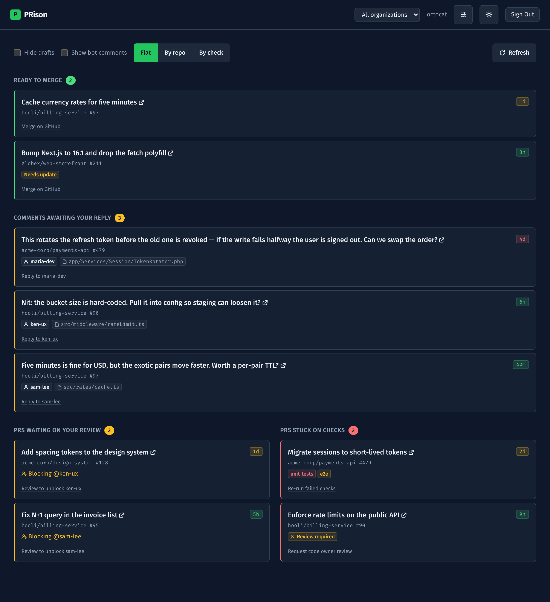

# PRison

[](https://github.com/mfozmen/PRison/actions/workflows/ci.yml)
[](https://sonarcloud.io/summary/new_code?id=mfozmen_PRison)
[](https://sonarcloud.io/summary/new_code?id=mfozmen_PRison)

A read-only GitHub dashboard that shows which pull requests need your attention,
and for how long — across your personal account and every organization you can
access. Four lists, oldest first:

- **Ready to merge** — PRs GitHub reports as mergeable now. Out-of-date branches
  still count and get a **"Needs update"** hint (a bot/manual update handles them).
- **Comments awaiting your reply** — review threads on your own PRs where the last
  word isn't yours. Each row opens the comment itself, not the top of the PR.
- **Waiting on your review** — PRs you're blocking others on.
- **Stuck on checks** — your open PRs with failing/pending checks, or otherwise
  blocked from merging (required checks, review, or conflicts).



### Features

- **Unanswered review comments.** A thread is waiting on you when it is unresolved
  *and* its most recent comment isn't yours — replying adds a comment, so your own
  last word means the ball is back in the reviewer's court. The age counts from
  that comment, so you can see what you've been sitting on for four days. Bots
  write most review threads, so they're hidden behind a **Show bot comments**
  toggle.
- **Tracked checks → Awaiting.** GitHub's API hides "expected" required checks
  (e.g. a manually-triggered `qa/smoke` or automation) from non-admins. Name the
  checks you care about — org defaults plus per-repo overrides, with a
  type-to-search repo picker — and PRison shows them as **"⏳ Awaiting: &lt;name&gt;"**
  on a blocked PR until they report.
- **Grouping** — flat, by repository, or by check.
- **Light / dark theme**, responsive two-column layout, minute-level ages,
  color-coded lists, and a Refresh button.
- **Personal account + per-org filter** in the top-right switcher.
- **Your own access** — sign in with the GitHub CLI or a token; no third-party
  app to approve. Every row deep-links to GitHub; PRison never writes anything.

## Getting started

PRison runs on **your own machine** — no third-party app to approve. The easiest
way is Docker (one command); or run it locally with Node.

**Sign Out** ends *your session* — it clears the encrypted cookie. It cannot revoke
the host's credentials: on a `GITHUB_TOKEN`-configured instance, one click signs you
back in, and anyone who can reach the instance can do the same. That is what the
warning below is about.

> [!WARNING]
> Sign-in mints a session from the host's GitHub credentials (your `gh` CLI token
> or a `GITHUB_TOKEN`). PRison is designed to run on your own machine — do NOT
> expose a `gh`-authenticated or `GITHUB_TOKEN`-configured instance on a reachable
> network without adding your own access control.

### Run with Docker (recommended)

Zero-config — `AUTH_SECRET` is auto-generated and persisted in a volume (nothing to set):

```sh
GITHUB_TOKEN="$(gh auth token)" docker compose up --build   # http://localhost:3000
```

Passing your `gh` token signs you in automatically — needed for SSO-restricted orgs
(where SSO/SAML enforcement blocks classic PATs). The token rotates, so re-run when
it expires. Without `GITHUB_TOKEN`, just open the app and paste a token.

### Run locally (development)

```sh
npm install
npm run dev        # http://localhost:3000
```

`npm run dev` generates `AUTH_SECRET` into `.env.local` on first run (it encrypts
the session cookie) — nothing to configure. Open the app and click **Sign in with
GitHub CLI**; the server reads your CLI token and stores it only in an encrypted,
httpOnly cookie — never in the browser.

### No GitHub CLI? Paste a token

If `gh` isn't installed or signed in, the app falls back to a paste-a-token form:

1. Go to [github.com/settings/tokens](https://github.com/settings/tokens/new?scopes=read:org,repo&description=PRison) → **Generate new token (classic)**.
2. Select the **`read:org`** and **`repo`** scopes, generate, and copy it.

> [!NOTE]
> For SAML SSO orgs, click **Configure SSO** on the token and **Authorize** it —
> self-service, no org owner approval. Some orgs forbid classic PATs entirely;
> there the GitHub CLI token is the only way in.

## Usage

Sign in with the GitHub CLI or paste a token. In the top-right: the **switcher**
scopes to All / your personal account / a single org; the **sliders icon** opens
**Tracked checks** (name the required checks to see as "Awaiting"); the **sun/moon**
toggles the theme; **Sign Out** clears the stored token. Click a **PR title** (or a
suggested-action link) to jump to GitHub — a comment row lands on that exact
thread. Use **Flat / By repo / By check** to group, **Hide drafts** and **Show bot
comments** to filter, and **Refresh** to re-fetch without reloading.

## Documentation

- [CONTRIBUTING.md](CONTRIBUTING.md) — conventions, tests, and CI setup
- [docs/DESIGN.md](docs/DESIGN.md) — design system
- [docs/UI-AUDIT.md](docs/UI-AUDIT.md) — UI/UX audit notes

Licensed under [MIT](LICENSE).
